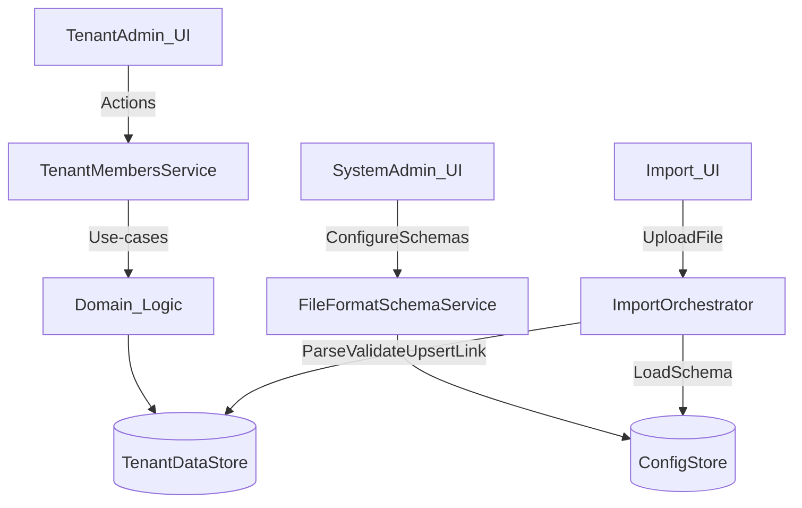

# المعمارية التقنية (Architecture) — Tenant Members Management

## نظرة عامة

الخدمة تُقسم إلى Use-cases صغيرة (Application Layer) تعمل فوق طبقة نماذج البيانات (Domain/Data) وتتعامل مع:

- **إدارة الطلاب**: إنشاء/إضافة/نقل/فصل + إلزام ربط الصف/الفصل.
- **إدارة أولياء الأمور**: إنشاء/تحديث + ربط/فصل أبناء.
- **إدارة الموظفين**: إضافة/تحديث + تعيين أدوار + فصل من الجهة.
- **الاستيراد**: Parsing + Validation + Upsert + Linking.
- **تهيئة مخططات الملفات (System/Admin)**: تعريف “File Format Schema” تُستخدم بواسطة الاستيراد.

## حدود الخدمة (Service Boundaries)

- **مدخلات**:
  - استدعاءات API أو UI Actions من لوحات إدارة الجهة.
  - ملفات استيراد (Excel/CSV) يرفعها مسؤول الجهة.
  - مخططات ملفات (Schemas) تُعدل بواسطة مسؤول النظام/الدولة.

- **مخرجات**:
  - إنشاء/تحديث عضويات الجهة (Student/Guardian/Employee).
  - تحديث روابط Pivot وعلامات تاريخية (released_at / unlinked_at).
  - نتائج الاستيراد: قوائم أخطاء، إحصاءات، وعمليات غير متزامنة (Jobs) عند الحاجة.

## تدفق عالي المستوى

## الوحدات (Modules)

### 1) TenantMembersService (Application)

مجموعة Use-cases مثل:

- `CreateStudentAndAttachToTenant`
- `AttachExistingStudentToTenant`
- `MoveStudentToSection`
- `UnlinkStudentFromTenant`
- `CreateGuardian`
- `LinkGuardianToStudent`
- `UnlinkGuardianFromStudent`
- `AddEmployeeToTenant`
- `UpdateEmployeeRoles`
- `UnlinkEmployeeFromTenant`

### 2) FileFormatSchemaService (System/Admin)

يُدير:

- تعريف schema لكل نوع ملف (طلاب/بيانات إضافية/أولياء/موظفين…).
- عناصر schema: `start_row`, `increments`, ومحددات الحقول (`x`, `y_offset`, `relative`).

### 3) ImportOrchestrator (Import)

يُدير:

- جلب schema المناسب (حسب الدولة/السياق).
- Parsing إلى “صفوف منطقية” (Logical rows).
- Validation (على مستوى الملف وعلى مستوى الجهة).
- Upsert لبيانات المستخدم/العضوية.
- Linking (طالب↔جهة، طالب↔فصل، طالب↔ولي، موظف↔جهة).
- Jobs لاحقة مثل توليد كلمات مرور افتراضية أو تنظيف التكرارات.

## قرارات تصميم رئيسية

- **التعامل مع العلاقات عبر Pivots**:
  - فصل الطالب/الموظف من الجهة أو من الفصل يتم عبر تحديث `released_at` لا حذف الرابط.
  - فصل ولي الأمر عن الطالب يتم عبر `unlinked_at`.

- **إلزام المرحلة/الفصل (Mandatory Grade Policy)**:
  - جميع نقاط الإدخال (Create/Edit/Import) يجب أن تمنع وجود “طالب مرتبط بالجهة” بدون فصل فعّال.
  - أي عملية نقل/فصل تُحافظ على الاتساق وتمنع حالات “Orphan student”.

- **Team-scoped RBAC**:
  - الصلاحيات تُقيَّم ضمن سياق الجهة الحالية (Tenant context).

