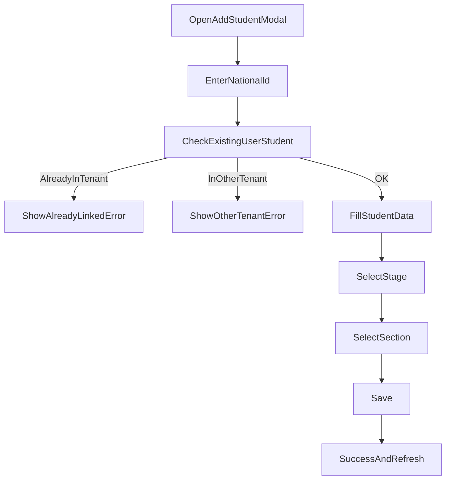
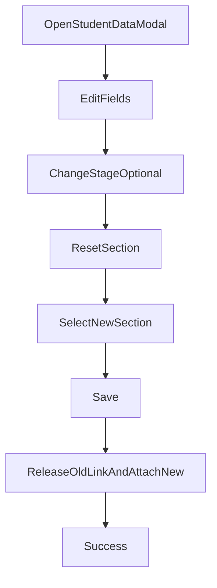
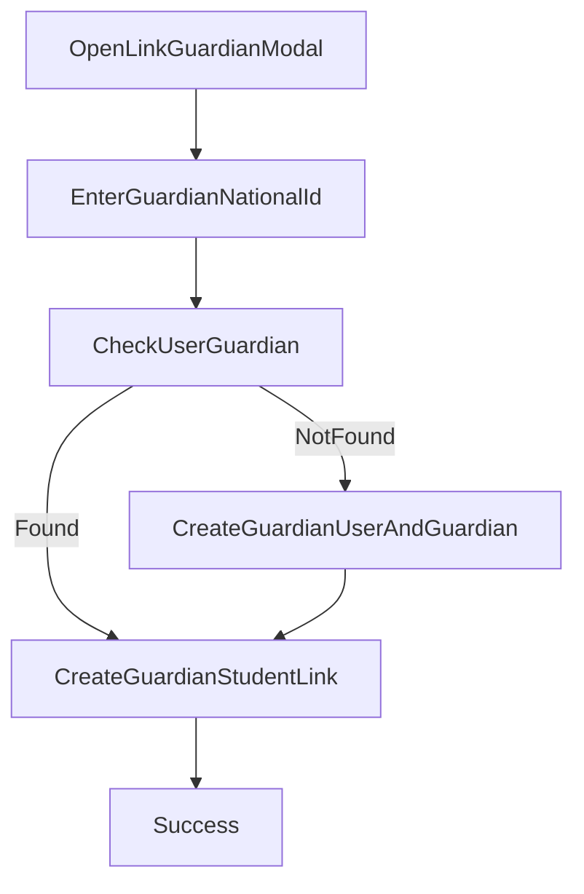
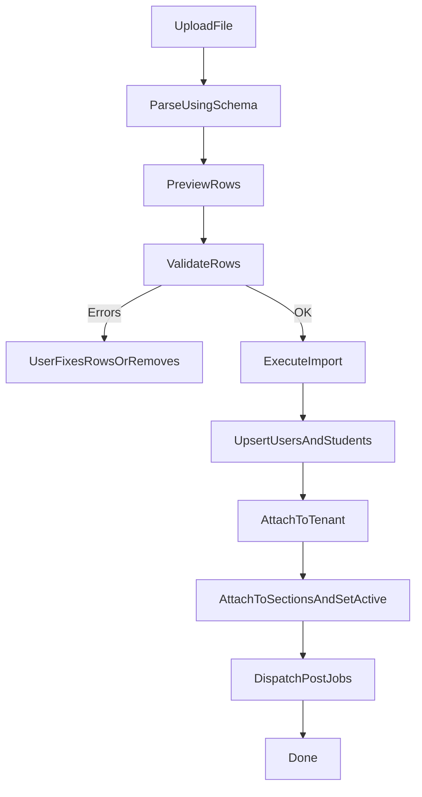

# التدفقات (Flows) — Tenant Members Management

## 1) إضافة طالب يدوياً (Manual add student)

نقاط إلزامية:

- لا يمكن حفظ الطالب بدون `stage` و`section`.

## 2) تعديل بيانات الطالب ونقله لفصل آخر

## 3) ربط ولي أمر بالطالب

## 4) استيراد طلاب عبر ملف

